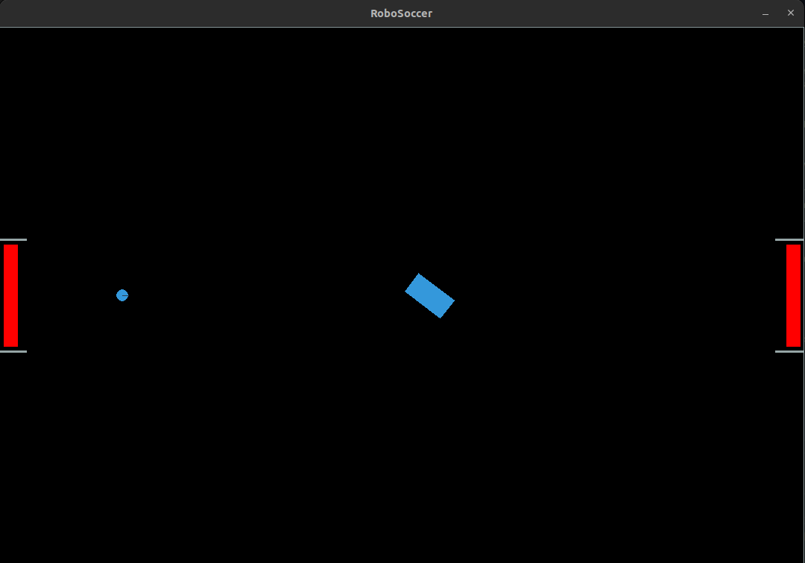

# An environment for training a deeplearning model that can play car soccer :soccer:

The goal of this part of the project is to train a custom model with reinforcement learning that can control robot cars based on incoming coordinates and angles from the directory robot_coordinates. To manage the RL algorithms, we use Stable Baselines 3, which is built on the PyTorch framework. To create a custom 2D environment, we use Pygame in combination with the Pymunk physics engine. Later we initialize this environment in OpenAI gym.

# Files :page_facing_up:

## pygame_2d.py
Here, you create your custom 2d pygame environment, and use PyMunk fysics. 
### 
At the very bottom you will see a PyGame2D Class, here you build your environment with the classes above and also set up some key training mechanisms, like the action space, a reward system, conditions when a epoch ends early, and what is being observed. These functions are not yet finished and still need to be optimized.
###
At the bottom you see some code commented out, if you comment this code back in, and run this file, you can play the pygame (controls are arrow keys).

## custom_env.py
Here, you can find a CustomEnv class. This class will initialize the custom Pygame environment in a OpenAI gym. 
###
You will find three more important training functions in this class. The reset function resets the environment when an epoch has ended and returns the observation. The step function moves the environment to the next state based on the input actions and returns the observations, the reward and whether the epoch should end early. Finally, the render function renders the pygame 2d graphics so you can see what is happening.

## checkenv.py
To check if the custom environment can be initialized in a OpenAI gym and all of the functions work properly, you can run this file.

## train_and_save.py
Here, you can define which RL algorithms you would like to train as also setup some hyperparameters. You can also monitor the training process on a tensor board. 
###
You'll see that some code is commented out because I was still working on setting up multi-environment training ton multiple threats. Unfortunately, I was not able to finish this part.

## load_and_play.py
When you want to see how your trained model behaves, you can load the model into this file. A new environment is then started and the model is run. 

# Sources :information_source:  
Learning tutorial:    https://youtu.be/XbWhJdQgi7E
####
OpenAI gym:           https://gymnasium.farama.org
####
Stable Baselines 3:   https://stable-baselines3.readthedocs.io
####
Pygame:               https://www.pygame.org
####
Pymunk:               http://www.pymunk.org
